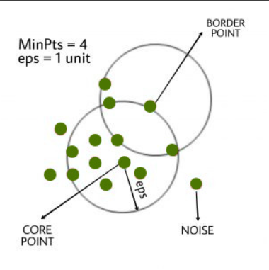

# DBSCAN_Clustering
DBSCAN stands for Density-Based Spatial Clustering Of Applications With Noise. This algorithm creates clusters based on the density of points in the neighborhood of a given point.
 
 
This algorithm takes two hyperparameters, epsilon(eps) and minPts(min points). 
 
<h5>Epsilon (eps)</h5>- It is the radius of the hypersphere neighborhood around a point. All points inside this radius neighbors.
 
<h5>Min Points (minPts)</h5>- It is the minimum number of neighbor points to be inside the hypersphere for the other point to be considered a core point.
 
 
This algorithm classifies a point into 3 types: core point, border point and noise. 
 
<h5>Core point</h5>- A point, which has neighbor points >= minPts inside its hypershere is called a core point.
 
<h5>Border point</h5>- A point which is not a core point but is neighbor of a core point is a border point.
 
<h5>Noise</h5>- A point which is neither a core point nor a border point is called noise.
 
 

 
 
One more concept we need to be familiar with before progressing to the code is Density Connected points.
 
 
<b>Density Connected Points</b>- If a point A is a neighbor of B (under fixed eps and minPts), B is a neighbor of C then we say that A is also a neighbor of C. In this way we chain points and assign them to the same cluster label. This chaining is applied in the growclusters function of our code.
 
 
Links referred to for getting a good grasp of DBSCAN : https://www.analyticsvidhya.com/blog/2020/09/how-dbscan-clustering-works/   https://www.geeksforgeeks.org/dbscan-clustering-in-ml-density-based-clustering/
